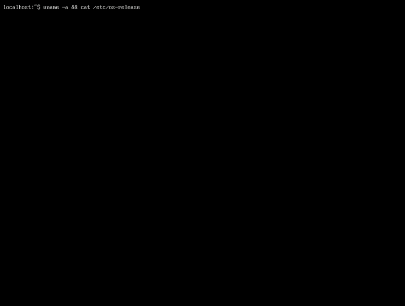

This is a minimal port of Copy Fail LPE (CVE-2026-31431) which patches the first few bytes of /etc/passwd so that su-ing to root requires no password. This reduces the total size of the original exploit and makes it more portable. Distributions like Alpine use busybox/musl instead of a standalone su binary and glibc, so the original binary patching method generally doesn't work. I specifically wanted to make a port that works on Alpine, but this method should work on just about every distro with a vulnerable kernel regardless of the underlying coreutil format since it relies on more ubiquitous targets. (note this poc is not a container escape)

Simply run as an unprivileged user using `python3 exp.py` and enjoy your root shell.

Tested on Alpine Linux 3.20.5 running kernel 6.6.69.

The compressed blob contains the byte string `root::0:0:` which patches the 'x' out of the original entry for root (`root:x:0:0:root:/root:/bin/sh`), bypassing the check for a password in /etc/shadow when su is called.

References:
[Alpine advisory](https://security.alpinelinux.org/vuln/CVE-2026-31431)
[Original POC](https://github.com/theori-io/copy-fail-CVE-2026-31431)

